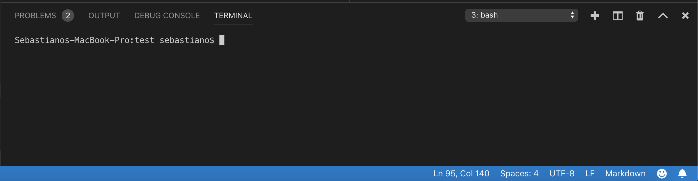
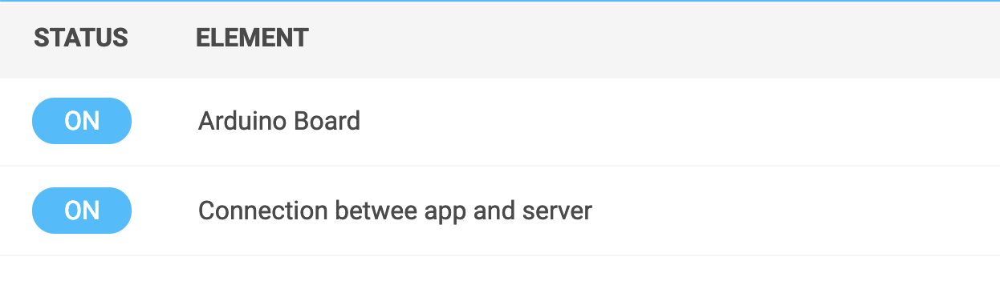

# Hack Belgium for kids

## Coding ? What the hell is coding ?! 
Coding allows you to communicate with a machine. :computer: In the same way  peoples uses french, english, dustch,... to understand each other, there are many programming languages that let you speak to a machine. Today, we will focus on the one used in websites and web application devlopment.

### Html (HyperText Markup Language)

Html is not really a programming language. It's a markup language. Html is key in programming for the web, since it's used for structuring a web page. In comparison with the human body, it would be the skeleton aka the bones, muscles and flesh of the body.

Html uses markup also callend html tags to define a structure, you can find here some of the most used:  
```html
<!-- A block of content --> 
<div></div>

<!-- An image --> 


<!-- A link --> 
<a href=""></a>

<!-- A title --> 
<h1></h1>

<!-- a text paragraph --> 
<p></p> 
```

As you can see, some tags have and opening and closing tag, others like the image element has only one tag. 

### CSS (Cascading Style Sheets)

CSS is a styling language. It's used in order to change the display and position of a webpage's elements. With css you can change color and size of every html element. In coparision with the human body, this all the esthetic part : size and color of the hair, color of the eyes and the skin, size and weight of the body,...

In order to use css, you should select element in the  html trought classes and apply them some properties

```css 

/* Change the color of the text to blue*/ 
color:blue;

/* Change the color of the background to black */ 
background-color:black;

/* Add an image has a background of an element */ 
background image: url('./images/bg-01.jpg');

/* Add a red border of 5px width to the left of the element */ border-left: 5px solid red;
```

### Javascript

JavaScript is a programming language used in order to handle interactions between a user and the application/website. JavaScript has gained some traction these days and can be used for the web, but allow us also to communicate with connected objects,  mobile phone app, desktop applications, and can even run a server.

JavaScript is more complex than html and css, it uses functions (blocks of code you can reuse) to execute precise tasks :

```js 

/* A variable */
var text  = 5;

/*Declaring a function*/ 
function nameOfMyFunction(){     
    console.log('hello');
}

/*Use it */  

nameOfMyFunction();

/*Conditional statement*/ 
if(5 > 3){
    console.log(5 is greater than 3);
}

/*Loop*/ 
for(var i  = 0; i < 10; i++){ 
    console.log(i) 
}

```

## Use coding in order to customize your application

First to start your project run the following command in  your terminal :

```npm start ```



This allows your project to start and can now be modified. Open your favorite browser and visit this  website :  http://localhost:5000/ this is your application.

To  test it, we need to be sure the board is connected to your computer. If you see the status board on the webpage blue then you are ready to start.



The app is configure to say hello when you click on the button of the  arduino. Try-it.

Cool, let's try to change the text so that when you click on the button,the app says hello to you ! To do this,  go  to `/public/main.js` file and find this  function.

```js
socket.on('buttonPress', function (data) {   
    showMessage('Hello');
    //happyEmot();
    //angryEmot();
    toggleMessageBox();
});
``` 

This function is executed each time the  button is pressed. You just have to add your name after Hello, like this: 

```js
socket.on('buttonPress', function (data) {   
    showMessage('Hello Sebastiano');
    //happyEmot();
    //angryEmot();
    toggleMessageBox();
});
```

Save the file with `ctrl + s`, got to your browser and check the status board to be sure everything is ok, if not, refresh  the page.

Now press the button on the arduino board and Tadadaaaammmm ! 

You can play with other options try to comment the ` showMessage()` function by using `//` in front of the line and un-comment `happyEmot()` by removing the comments `//`. 

Do you see and happy emoji ? Cool ! Time for you to check with `Sebastiano` on how you can implement your idea.

When your idea is implemented you can personalise the website by playing with css. 

If you want to change the background image of the website, the one with the subway, go online and search for an image. If you have found something cool, save-it to the image `/public/images `directory along with : `bg-01.png`, `bg-02.png` and  `bg-03.png`.

Then you can go to `/public/style.css` file :

```css @import './core/core.css';
/* Color of the title (Hack Belgium for kids) */ 
.site-title{     
    color: #16BEFF;
}

/* Background image */ 
.header{     
    background image: url('./images/bg-01.png');
}

/* color of the blue bar under the image */ 
.date-container{     
    background-color: #16BEFF;
}

/* Color of the border of the message box */ 
.message{  
    border-left: 5px solid #16BEFF;
}

/* Backgground and text color on the on bubbles */ 
.status--on{     
    background-color: #16BEFF;
    color: #FFFFFF;
}

```

There are some comments for every block of code so you can find your way in the file. If you want to use your freshly saved image, you have to change the link in ` background image: url('./images/bg-01.png');` . Pay attention to the extension of your image `jpg`, `png`, `giff`, ...

If you want to change the colors go to [flatuicolor](https://flatuicolors.com/palette/nl) and click on one of the colors to automatically copy the color and replace the ones in `style.css` file.

Don ? Good !!! this means, you have your own application running with and arduino board. Go customise your board case with some stickers.

 